# TalentLens — Architecture & Integration Flows

---

## 1. System Overview

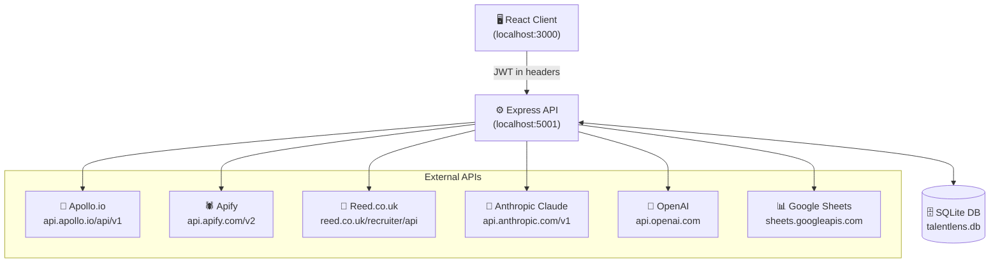

---

## 2. Authentication & API Key Flow

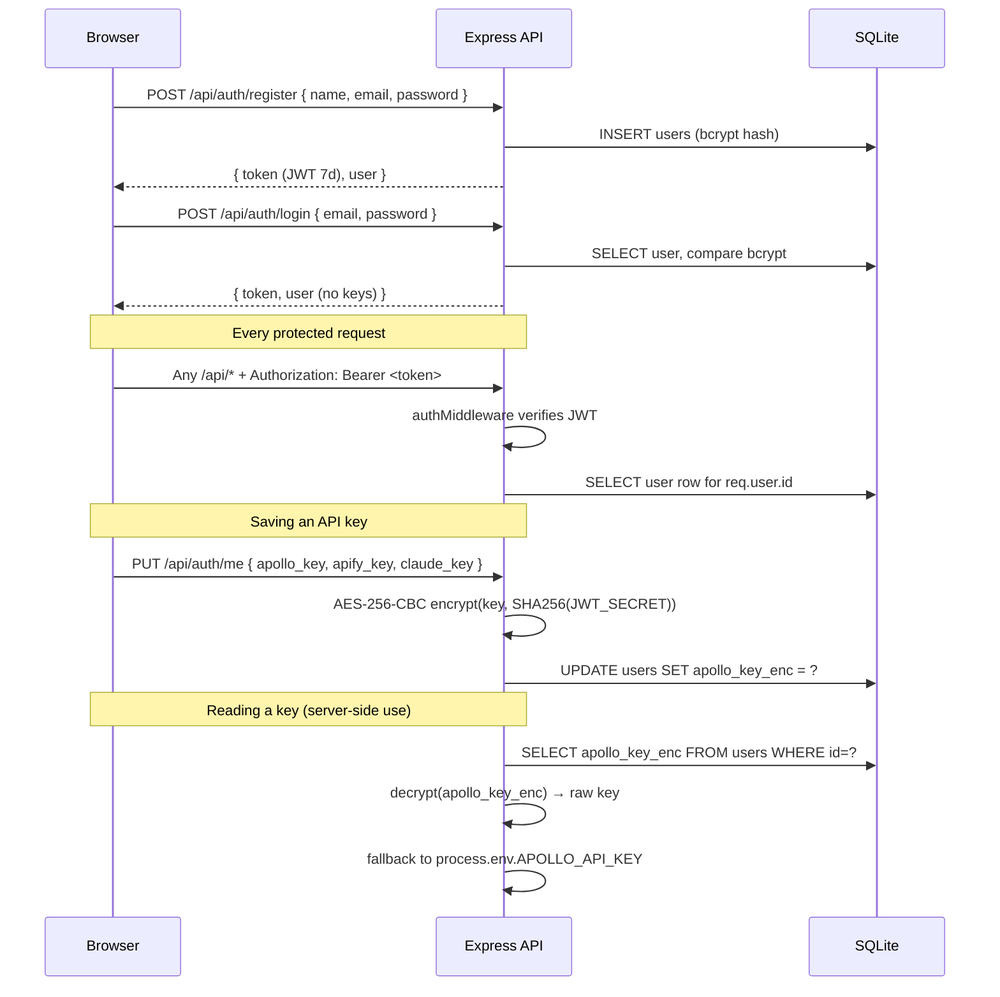

---

## 3. Candidate Search — Platform Selection Flow

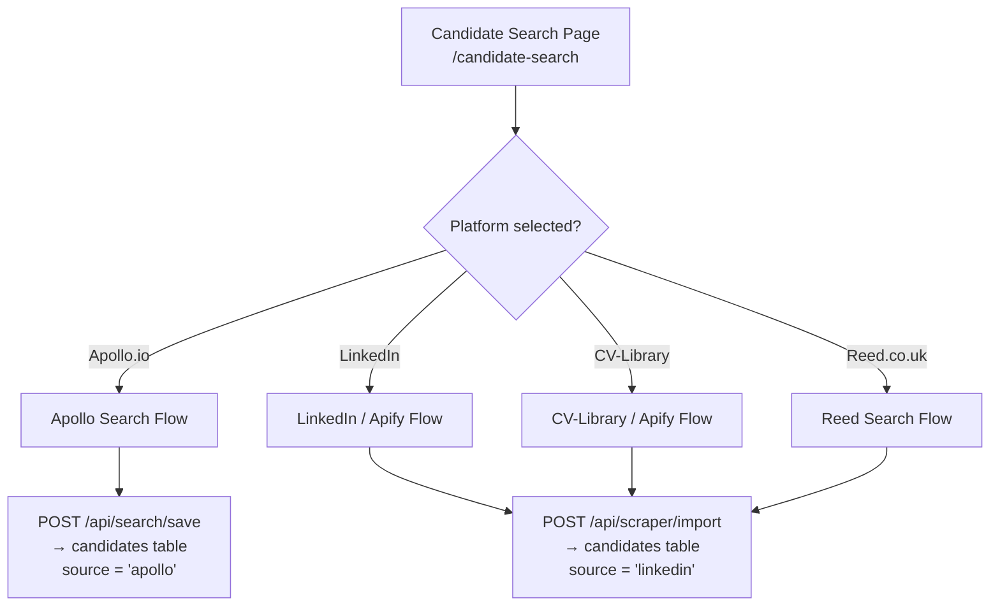

---

## 4. Apollo.io Search Flow

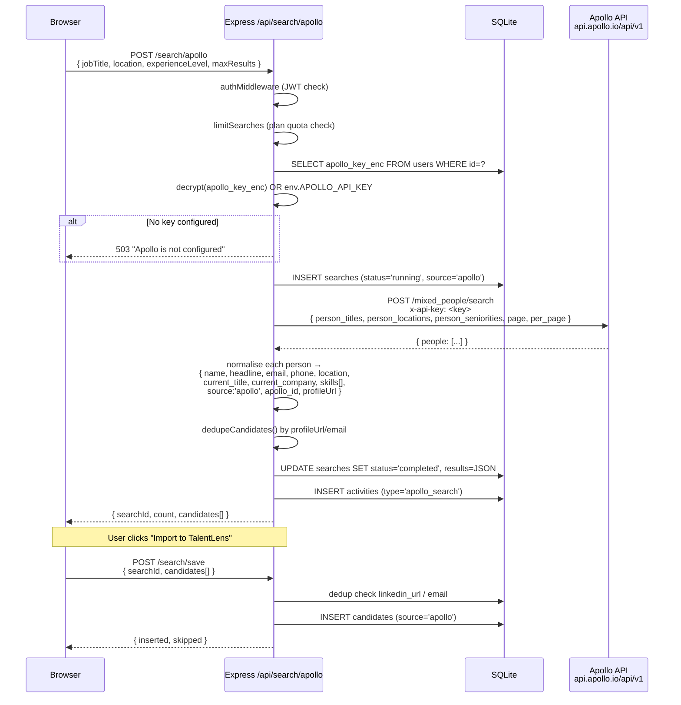

---

## 5. LinkedIn / Apify Search Flow

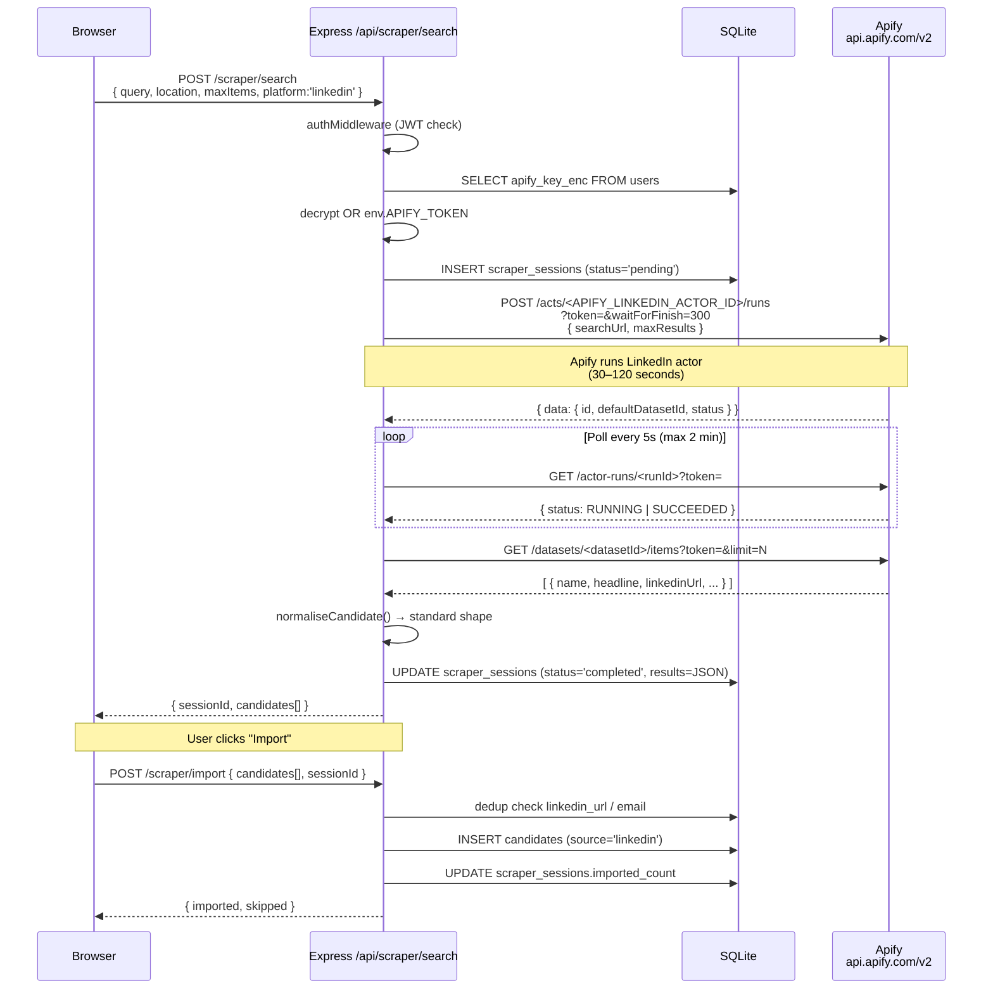

---

## 6. CV-Library / Apify Search Flow

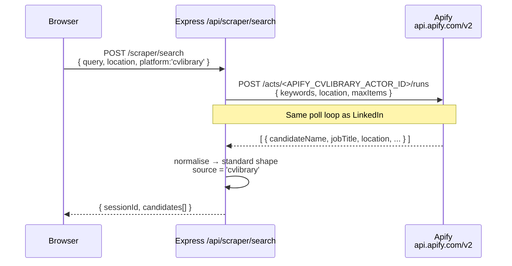

---

## 7. Reed.co.uk Search Flow

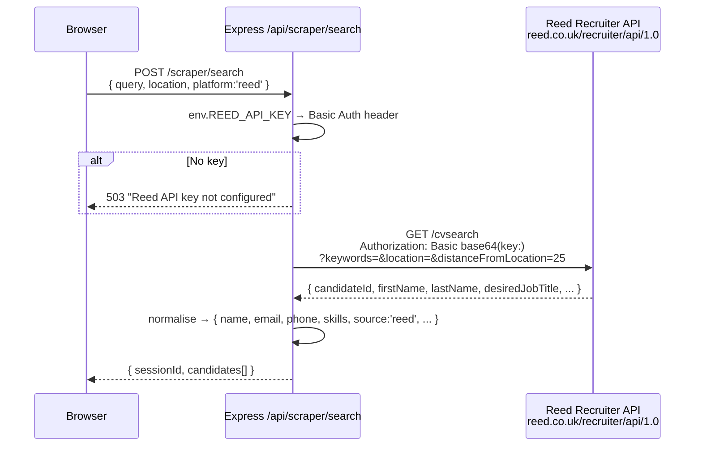

---

## 8. AI Resume Screener Flow (Claude / Local)

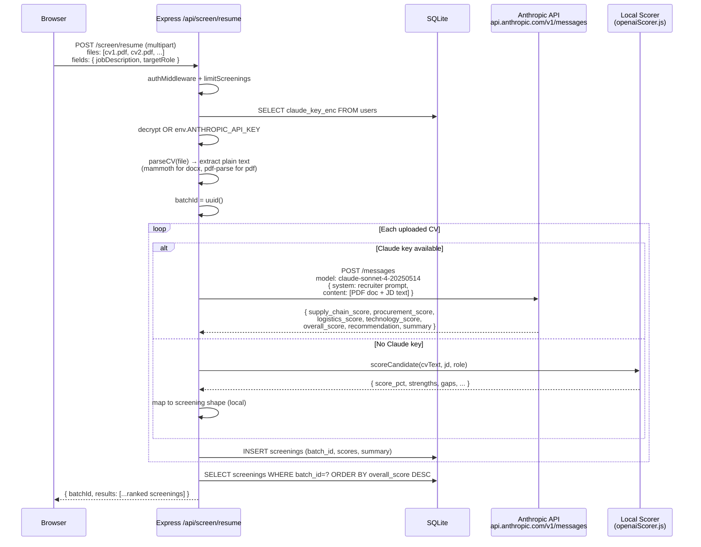

---

## 9. CV / Job Match Flow (OpenAI)

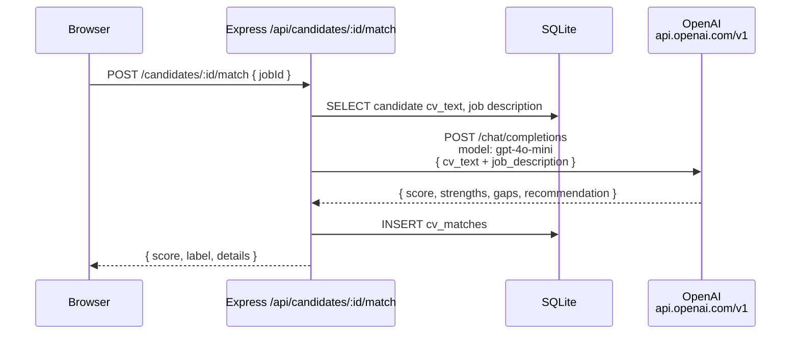

---

## 10. Google Sheets Export Flow

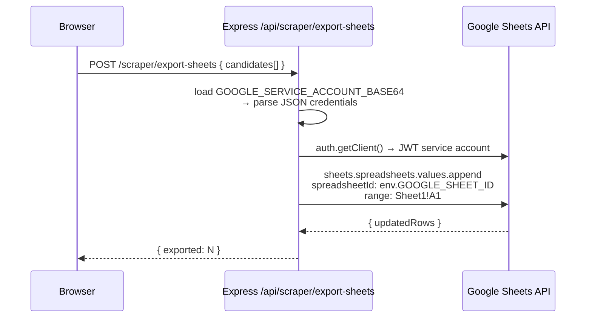

---

## 11. Plan Limits (Rate Limiting)

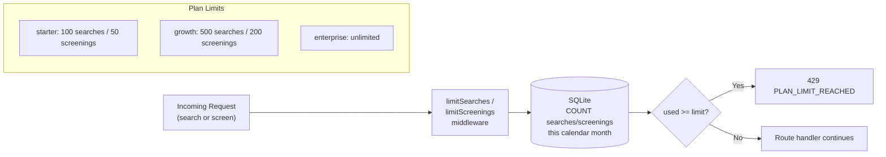

---

## 12. Database Tables & Relationships

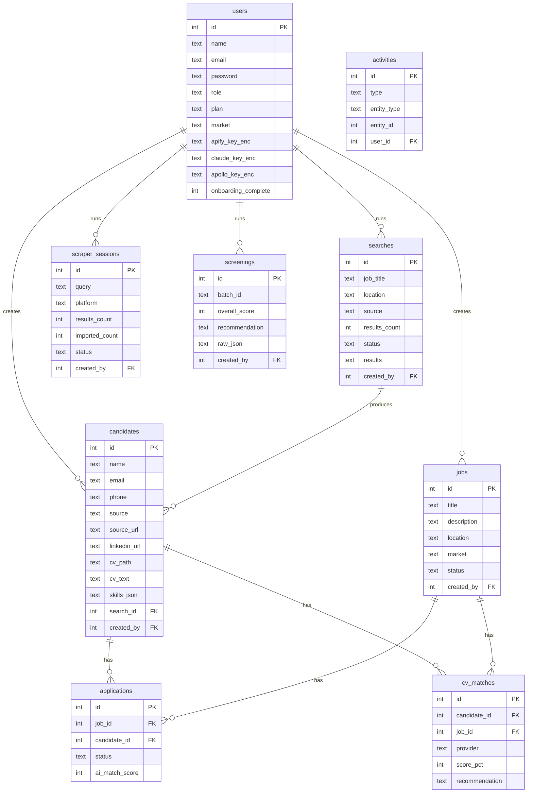

---

## 13. Full API Route Map

| Method | Route | Auth | Service | External Call |
|--------|-------|------|---------|---------------|
| POST | `/api/auth/register` | — | bcrypt | — |
| POST | `/api/auth/login` | — | bcrypt + JWT | — |
| GET | `/api/auth/me` | JWT | — | — |
| GET | `/api/auth/me/keys` | JWT | AES-256 decrypt | — |
| PUT | `/api/auth/me` | JWT | AES-256 encrypt | — |
| GET | `/api/jobs` | JWT | — | — |
| POST | `/api/jobs` | JWT | — | — |
| GET | `/api/candidates` | JWT | — | — |
| POST | `/api/candidates` | JWT | — | — |
| POST | `/api/candidates/:id/match` | JWT | openaiScorer | OpenAI GPT-4o-mini |
| **POST** | **`/api/search/apollo`** | **JWT + plan** | **apolloService** | **Apollo.io** |
| POST | `/api/search/linkedin` | JWT + plan | linkedinSearchService | Apify (harvestapi actor) |
| POST | `/api/search/save` | JWT | — | — |
| GET | `/api/search/history` | JWT | — | — |
| POST | `/api/scraper/search` | JWT | apifyService / reedService | Apify or Reed API |
| POST | `/api/scraper/import` | JWT | — | — |
| POST | `/api/scraper/export-sheets` | JWT | sheetsService | Google Sheets API |
| GET | `/api/scraper/platforms` | JWT | — | — |
| GET | `/api/scraper/test-connection` | JWT | apifyService | Apify |
| POST | `/api/screen/resume` | JWT + plan | claudeScreener / scorer | Anthropic Claude |
| GET | `/api/screen/history` | JWT | — | — |
| GET | `/api/history` | JWT | — | — |
| GET | `/api/dashboard` | JWT | — | — |
| GET | `/api/users` | JWT + admin | — | — |
| GET | `/api/health` | — | — | — |

---

## 14. Environment Variables Reference

| Variable | Required | Used By |
|----------|----------|---------|
| `JWT_SECRET` | ✅ | Auth signing + AES-256 key derivation |
| `APOLLO_API_KEY` | fallback | Apollo search (per-user key takes priority) |
| `APIFY_TOKEN` | fallback | LinkedIn + CV-Library scraper |
| `APIFY_LINKEDIN_ACTOR_ID` | for LinkedIn | Apify actor for LinkedIn profiles |
| `APIFY_CVLIBRARY_ACTOR_ID` | for CV-Lib | Apify actor for CV-Library |
| `REED_API_KEY` | for Reed | Reed Recruiter API |
| `ANTHROPIC_API_KEY` | fallback | Claude resume screener |
| `OPENAI_API_KEY` | optional | CV/job match scoring |
| `GOOGLE_SHEET_ID` | optional | Google Sheets export |
| `GOOGLE_SERVICE_ACCOUNT_BASE64` | optional | Google Sheets auth |
| `PORT` | optional | Express port (default 5001) |
| `DB_PATH` | optional | SQLite file path |
